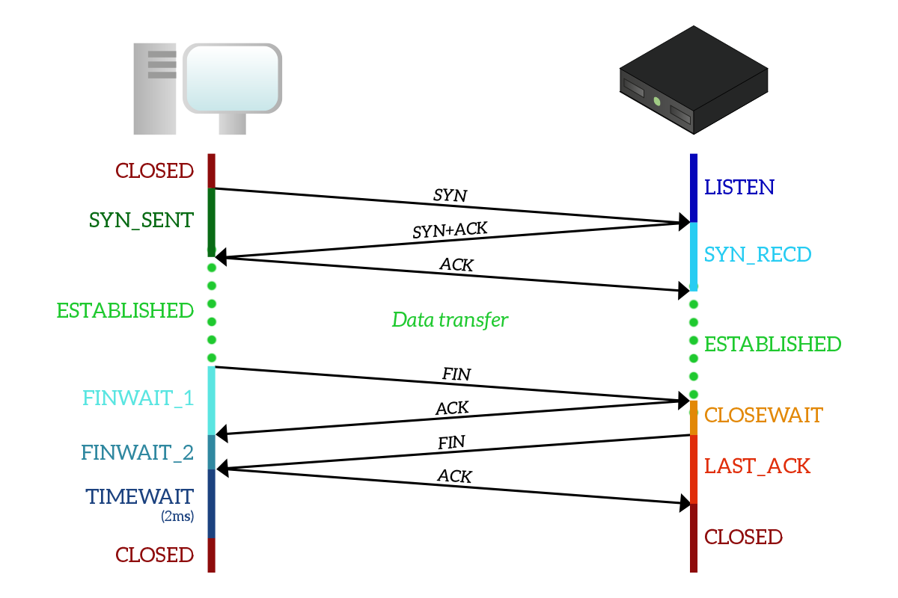

`Definition of Transmission Control Protocol` 

    Connection oriented, reliable and stream based protocol

- Connect (Three handshakes) 

    1. Client sends a SYN package to the server, transits into SYN_SEND state.
    
    2. Server receives the SYN witha SEQ number, then replies with a ACK, SYN along with a SEQ + 1, then transits into SYN_RECEIVED state

    3. Client receives the package, check the SEQ number and returns with a ACK if it matches, then transits into a ESTABLISHED state.

    There are a few things in terms of the three handshakes. Normally, in order to establish a tcp connection, those three handshakes are required. First of all, the server side actually gives the power of actively establish a connection to the client, since the client side has the entire context of which connection should be established, or say, which file descriptor should be used. Image this case, if there's a traffic congestion, the server receives the SYN + SEQ package where the sequence number is already expired at the client side. If server decides to establish connection based on that sequence number, then error will occur. Also there are cases of using only two handshakes in order to establish the connection, which is called TCP Fast Open, it basically let the application to solve the so called "History Connection Issue" 

- Close (Four wave hands)

    1. Client sends a FIN package that indicates that there's no data it wants to send   so please shutdown the connection elegantly, and transits into FIN_WAIT_1 state
    2. When server side receives the FIN package, it will transit into CLOSE_WAIT state, and send a ACK package to the client. After client receives the ACK, it transits into a FIND_WATI_2 state.
    3. When there's no data needed to be sent at the server side, it will send a FIN package to the client. Client receives the FIN package, replies with a ACK package and transits into TIME_WAIT state, server receives the ACK and transits into CLOSED state.
    4. The client will wait for 2 Maximum segment lifetime, then it will transit into CLOSED state

- Tips:
    1. consider the CLOSE_WAIT from the server side as waiting for all data to be sent. 
    2. reasons for TIME_WAIT state:
       1. Stop from the delayed packages. Each TCP package contains a unique SEQ number, if the client side to wait for 2 MSL as the TIME_WAIT and client is CLOSED, there might be a new connection established and will receive the delayed package
       2. Make sure the server side will shutdown elegantly. If the client is not waiting long enought, while the server hasn't received the ACK package, so it will consider the connection is still legit. When new connections from the client side are coming in, since the previous connection is still alive, the server will reject the SYN packge with a RST.

- Short and Long Connecrtions
  - Short Conn
    - Pros: 
      1. Easy to use.
      2. The numbers of the connections should be lower in theory.
      3. Friendly to stateless load balancing. 
    - Cons: 
      1. Performance Issue. Each connection has a 3-time shake hand and 4-time wave hand, including setting up timer, enqueue and dequeue, maintain time wait status.
      2. Slow start. After the connection is established, when the client starts to send data to the server. The speed of transmission will start from a small number, and each time multiplied by 2 until it reachs the limitation.
      3. Unstable.During the data transmission, if there are some network issues which let routers somehow lose the package, the client will resent the package after 200ms. But where resent during the shake hand period is on second level (rtt, rto).

  - Long Conn:
    - Pros:
    - Cons:
      1. Connection timeout. For example, MySQL server usually checks if there are some idle connections, which lead to connection timeout at the client side
